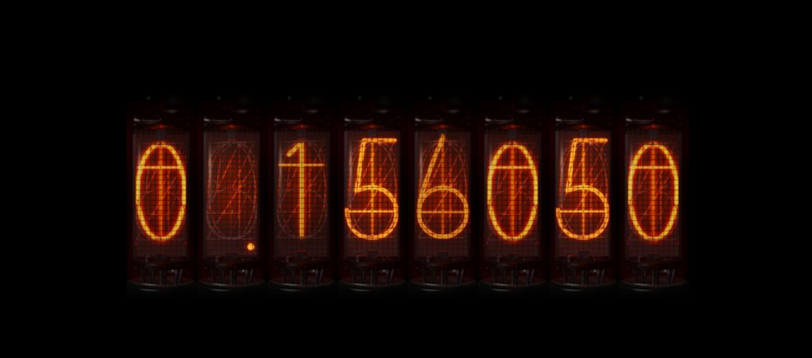
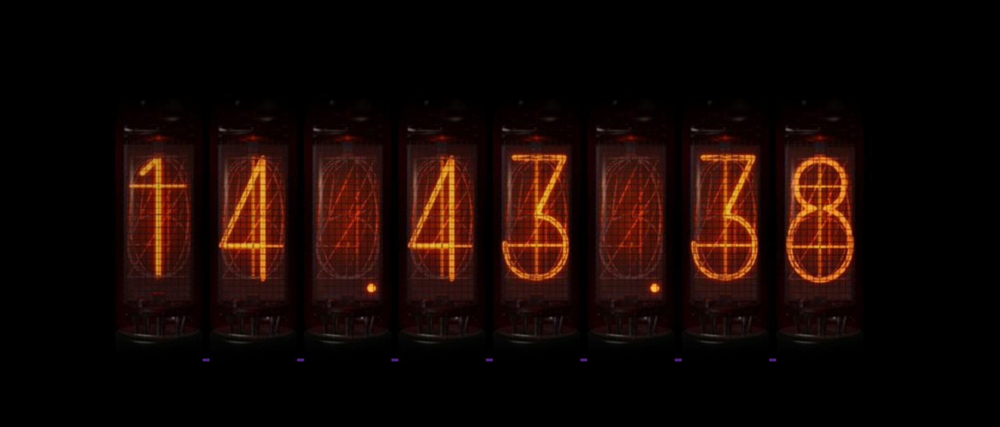
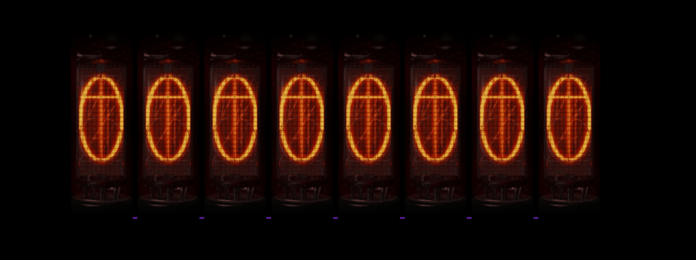

# Steins-Gate-Divergence-Meter-Clock-Visitor
This is a html inspired bySteins;Gate Divergence Meter Clock/VisitorCounter( THE Name is not decide)

you can install and use it without any action else,very convenient

It can record the number of page views of your website and the current time, 
and will continue to add the functions of various world lines/random world lines in the future
You can preview in this url:

http://longsong.games/Count_Visitor

When your number of visits is odd, the world line starts with 1, and vice versa when it is even

and

http://longsong.games/Time_Machine

click Divergence-Meter change model

 EL PSY KONGROOOOOOOOOO!

